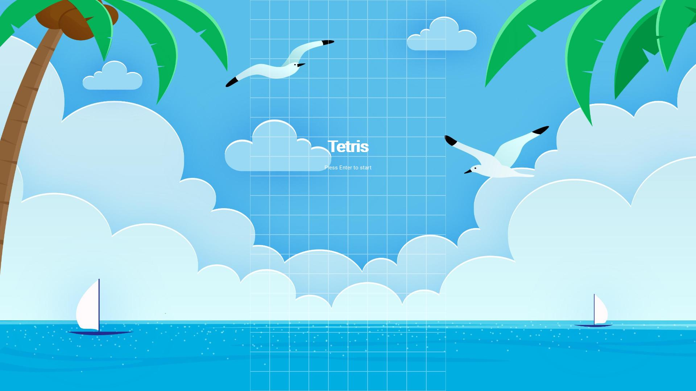
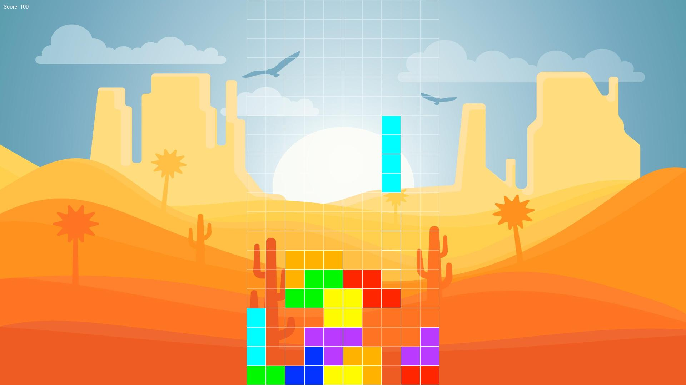
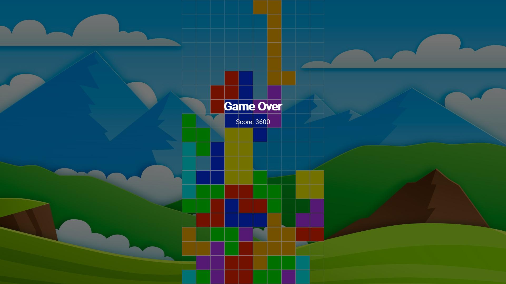

# SDL2 TETRIS

## Description
A tetris clone completely written in C++ using SDL2.

## Game Instructions

### Keybindings
- **Left Arrow**: Move the piece to the left
- **Right Arrow**: Move the piece to the right
- **Down Arrow**: Move the piece down
- **R Key**: Rotate the piece clockwise
- **E Key**: Rotate the piece counterclockwise
- **ESC Key**: Leave the game
- **SPACE Key**: Drop the piece
- **ENTER Key**: Start the game/Restart the game

### Gameplay
The game starts with a random piece falling from the top of the screen. The player can move the piece left or right, rotate it clockwise or counterclockwise and drop it. The goal is to fill as many rows as possible. When a row is filled, it disappears and the player gets points (100). The game ends when a piece reaches the top of the screen.

## Project Structure
```
.
├── Makefile
├── README.md
├── res
│   ├── backgrounds
│   │   ├── background_beach.png
│   │   ├── background_desert.png
│   │   └── background_mountain.png
│   ├── fonts
│   │   └── Roboto-Regular.ttf
│   └── icon
│       ├── icon.ico # Windows icon
│       ├── icon.rc # Windows icon resource file
│       ├── icon.res # Windows icon resource file
│       └── icon.png # SDL2 icon
├── screenshots
│   ├── beach_startscreen.jpg
│   ├── desert_playing.jpg
│   └── mountain_gameover.jpg
└── src
    ├── App.cpp # Main application class
    ├── App.h # Main application class header
    ├── Game.cpp # Game class
    ├── Game.h # Game class header
    ├── LTexture.cpp # Texture class
    ├── LTexture.h # Texture class header
    └── main.cpp # Main entry point
```

## Dependencies
- SDL2 -> https://www.libsdl.org/
- SDL2_image -> https://www.libsdl.org/projects/SDL_image/
- SDL2_ttf -> https://www.libsdl.org/projects/SDL_ttf/
- make
- g++ 
- mingw-w64-x86_64-g++ (Windows only) -> https://www.mingw-w64.org/
- mingw-w64-x86_64-SDL2 (Windows only)
- mingw-w64-x86_64-SDL2_image (Windows only)
- mingw-w64-x86_64-SDL2_ttf (Windows only)
- mingw-w64-x86_64-make (Windows only) -> chocolatey: https://chocolatey.org/packages/make

## Build
Once you have installed all the dependencies, making sure that the paths correspond to those descripted in the makefile or by manually changing them in the makefile itself, you can build the project by running the following commands:
```
git clone https://github.com/iacoviola/sdl2_tetris.git
cd sdl2_tetris
make release
```

## Run
(For Windows you can simply grab the executable from the [releases](https://www.github.com/iacoviola/sdl2_tetris/releases) page)\
Once you have built the project, you can run it by running the following commands:
```
cd build/release
./main
```

## Screenshots




## Attributions
- Backgrounds: https://www.freepik.com/
- Fonts: https://fonts.google.com/

## License
Read the [LICENSE](LICENSE) file for details.

## Author
Emiliano Iacopini